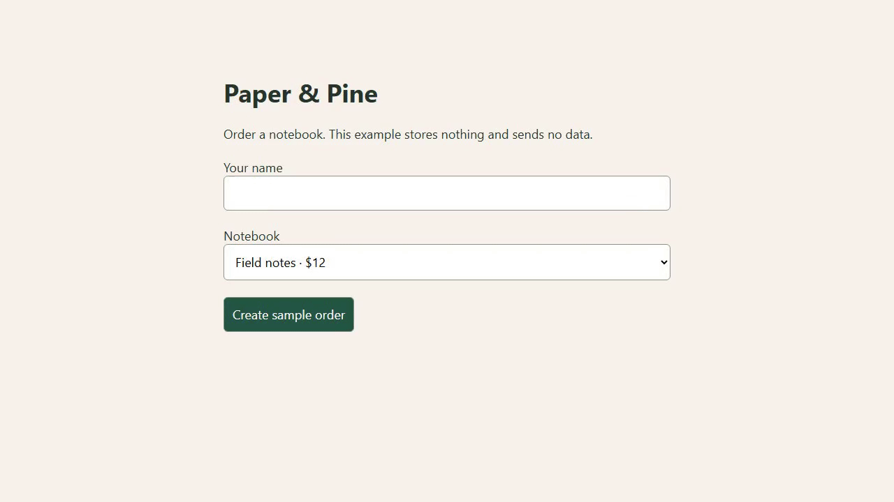

# DemoForge

[](https://github.com/Pastalikek65/demoforge/actions/workflows/ci.yml)

Turn a browser workflow into a repeatable demo. Record it once, edit the steps and privacy effects, replay it in real Chromium, then export video and step-by-step guides. Capture and export stay on your computer; no account or paid API is required.

**1.0.0 · Windows x64 and Ubuntu 24.04 x64.** Fresh packages passed recording, replay and four-format export acceptance at commit `c27561a`. DemoForge is for maintainers, support teams and developers who need to refresh demos when their web application changes.

**Downloads:** [DemoForge 1.0.0](https://github.com/Pastalikek65/demoforge/releases/tag/v1.0.0). Choose your platform's archive and verify it against the release's `SHA256SUMS.txt`. See the [verification record](docs/verification.md) for the tested scope.



See the [generated guide](examples/shop/output/guide.md) and [editor screenshot](docs/images/editor.png). These use only the bundled synthetic example.

## Install the desktop app

Download the Windows ZIP or Linux `tar.gz`, extract it, and launch the DemoForge application. On first start, choose **Install browser** to download the pinned Chromium runtime; this one-time step needs an internet connection. Export also requires FFmpeg with `libx264` and the `subtitles` filter. Linux installations must preserve Electron's sandbox helper ownership and mode; follow the [platform-specific install steps](docs/packaging.md). The archives are unsigned.

## Try the local example

For a source checkout, use Node.js 24 LTS and a local FFmpeg executable with `libx264` support. Chromium needs a one-time download; recording and exports then run locally.

```sh
npm ci
npm run browser:install
npm run build
node examples/shop/server.mjs
```

In another terminal:

```sh
node dist/cli.js doctor
node dist/cli.js replay examples/shop/workflow.demoforge.json --output artifacts/shop-run
node dist/cli.js export examples/shop/workflow.demoforge.json --run artifacts/shop-run/run.json --output artifacts/shop-demo --reviewed
```

Open `artifacts/shop-demo/guide.html`, `guide.md`, `demo.mp4` and `demo.gif`. The example uses synthetic data, does not accept payments and stores nothing. Output directories must be new; existing files are preserved.

If FFmpeg is not on PATH, set `DEMOFORGE_FFMPEG` to its full executable path. FFmpeg is separately installed and is not bundled. See [dependency notices](THIRD_PARTY_NOTICES.md).

## Use the editor

```sh
npm start
```

Enter an HTTP(S) URL, start recording and perform your single-tab workflow in the separate browser. Stop from the editor. Rename, reorder and edit the steps, then replay. Inspect the raw preview, add masking regions and review the recording before exporting.

Packaged desktop builds contain Electron and the editor; the workflow browser is downloaded directly from the vendor once using **Install browser** in the setup panel. The panel also identifies a missing external FFmpeg. An internet connection is needed for that initial download. Subsequent recording/replay/export runs locally. Windows ZIPs are unsigned. Linux archives require a desktop session and the system dependencies listed in [packaging](docs/packaging.md).

Navigation steps can use a full runtime URL variable. Known token/password query parameters are converted into secret URL variables during recording; enter the complete URL only when replaying. Ordinary reusable base URLs can use nonsecret variables. Automatic detection cannot recognize every kind of private URL.

CLI capture: `node dist/cli.js record --url http://127.0.0.1:4077/ --output artifacts/recording`. Press Enter in the terminal to finish.

Passwords and recognized sensitive fields become runtime variable references; their values are excluded from the project JSON. Supply replay variables as `DEMOFORGE_VAR_<NAME>` environment variables or in the editor. Automatic field detection is limited. **Raw local videos and screenshots can contain secrets and personal information.** They are not automatically included in exports, and they remain in the local capture folder. Review sanitized outputs before sharing.

## Current scope

- Single-tab navigation, click, text input, select and wait steps.
- Version-one project files with strict validation and atomic saves.
- Real Chromium WebM capture, replay and per-step screenshots.
- MP4, GIF, Markdown and offline HTML export; permanent opaque masking and trim/crop.
- Local desktop editor and headless replay CLI; controlled step failures and cancellation.

Timed annotations/subtitles, zoom, cursor emphasis and supplied audio are included. The 1.0.0 Windows and Linux packages passed checks for browser setup, recording, replay, masked/captioned exports in all four formats, and reopening the outputs. Source tests separately cover audio and media effects; the package flow does not test every effect combination. Video edits include the effects, while guide images use masks/crop and guide text includes relevant captions. Multi-tab flows, browser extension automation, signed installers and automatic authentication recovery are outside the current scope.

## Development and support

```sh
npm run typecheck
npm run build
npm test
```

Media tests require FFmpeg. Desktop tests require built assets and a display (Linux: Xvfb). See the [tested platform matrix](docs/support.md), [architecture](docs/architecture.md), [roadmap](docs/roadmap.md), [contributing](CONTRIBUTING.md), [security](SECURITY.md), and [Türkçe hızlı başlangıç](docs/quickstart.tr.md).

Licensed under Apache-2.0. No telemetry or upload backend.
